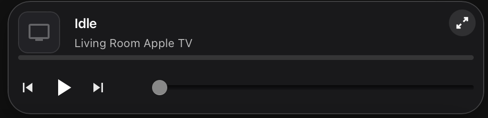
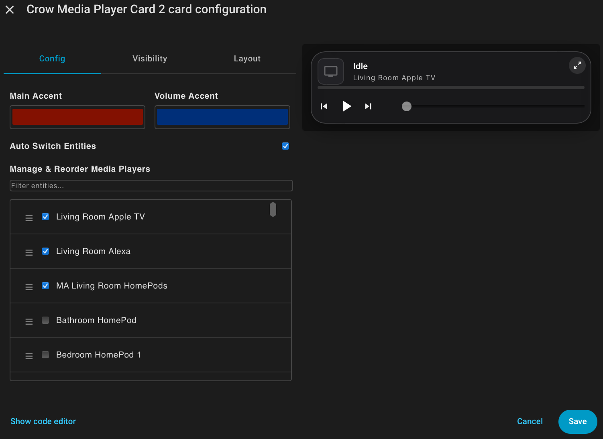

# Crow Media Player Card 2

A sleek, modern media player card for Home Assistant with iOS-inspired design, multi-device support, and intuitive controls.


## Features

- 🎨 **Beautiful iOS-Inspired Design** - Glassmorphic card with blur effects and smooth animations
- 📱 **Dual View Modes** - Toggle between full card and compact mini-player views
- 🔄 **Auto-Switching** - Automatically switches to the currently playing device
- 🎵 **Multiple Device Support** - Manage multiple media players from a single card
- ↕️ **Drag & Drop Reordering** - Easily reorder your media players in the visual editor
- 🎨 **Customizable Accents** - Separate color customization for main accent and volume slider
- 📱 **Mobile-Optimized** - Touch-friendly with smooth interactions and gestures
- ⏯️ **Full Playback Controls** - Play/pause, skip, shuffle, repeat, and volume control
- 📊 **Live Progress Bar** - Real-time playback progress with seek support
- 🖼️ **Album Art Display** - Shows album artwork or device-specific icons

## Screenshots

### Full Card View


### Compact Mini-Player


### Visual Configuration Editor


## Quick Configuration

### Using the Visual Editor

1. Add the card through the Home Assistant UI
2. Click "Configure" to open the visual editor
3. Customize colors, enable/disable auto-switch
4. Drag and drop to reorder media players
5. Check/uncheck boxes to add/remove devices

### YAML Example

```yaml
type: custom:crow-media-player-card-2
entities:
  - media_player.living_room_speaker
  - media_player.bedroom_tv
  - media_player.kitchen_echo
accent_color: '#007AFF'
volume_accent: '#FF6B00'
auto_switch: true
```

## Configuration Options

| Option | Type | Default | Description |
|--------|------|---------|-------------|
| `entities` | list | **Required** | List of media_player entity IDs |
| `accent_color` | string | `#007AFF` | Main accent color (hex) |
| `volume_accent` | string | `#007AFF` | Volume slider color (hex) |
| `auto_switch` | boolean | `true` | Auto-switch to playing device |

## Usage Tips

- **Toggle Modes** - Click the expand/collapse button in the top-right corner
- **Seek Position** - Click anywhere on the progress bar to jump to that point
- **More Info** - Click album art to open the media player's more-info dialog
- **Auto-Switch** - When enabled, the card switches to whichever device starts playing
- **Manual Override** - Selecting a device manually disables auto-switch until another device plays

## Supported Platforms

Works with any Home Assistant media player including:
- ✅ Spotify
- ✅ Amazon Echo/Alexa
- ✅ Google Cast
- ✅ Apple TV
- ✅ Sonos
- ✅ DLNA/UPnP devices

---

[View on GitHub](https://github.com/yourusername/crow-media-player-card-2) • [Report Issue](https://github.com/yourusername/crow-media-player-card-2/issues) • [Documentation](https://github.com/yourusername/crow-media-player-card-2#readme)
